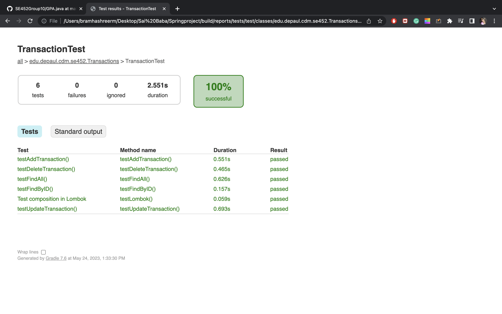
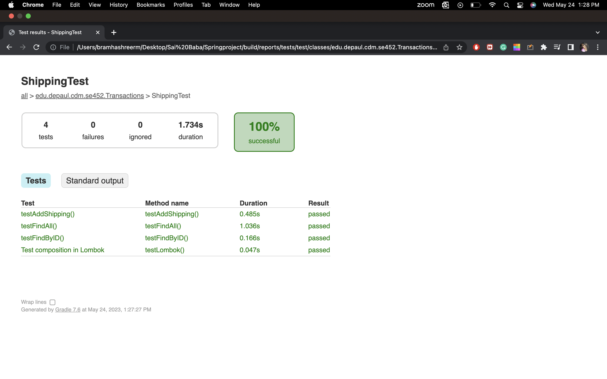
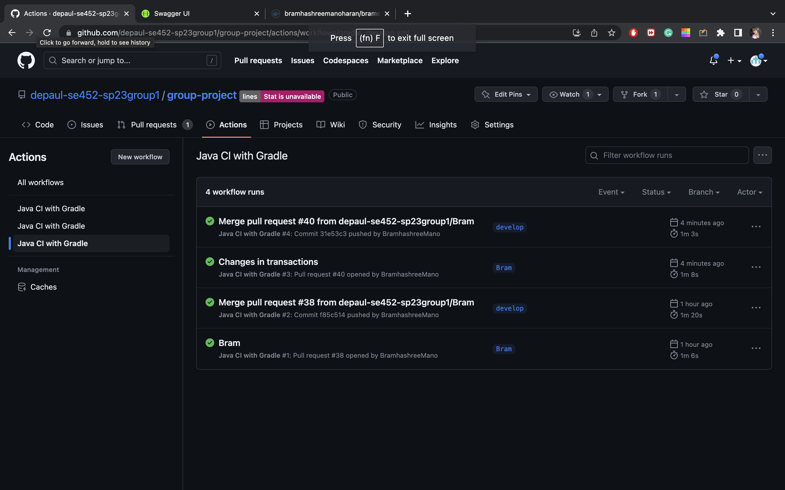
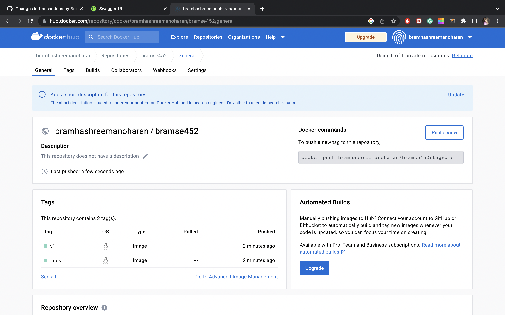
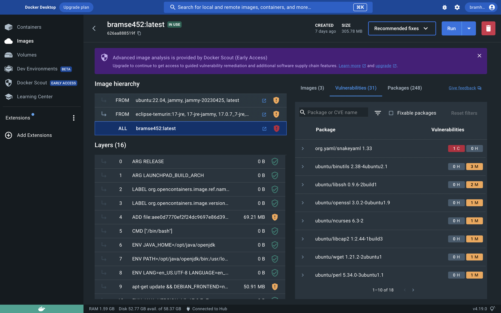
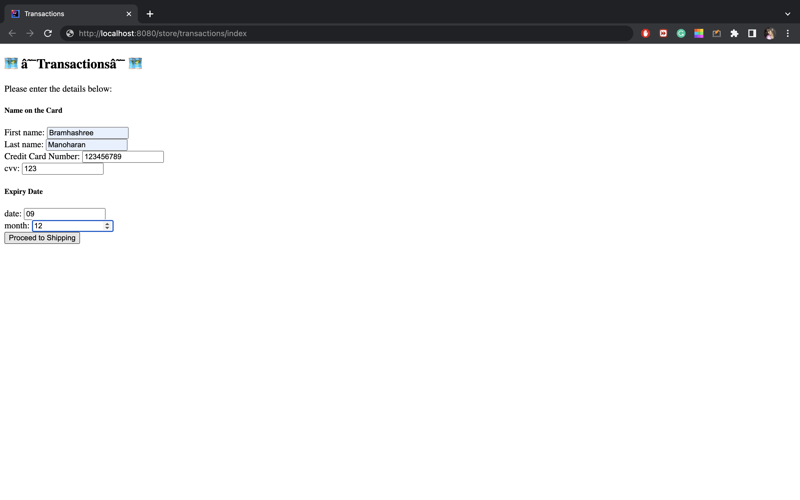
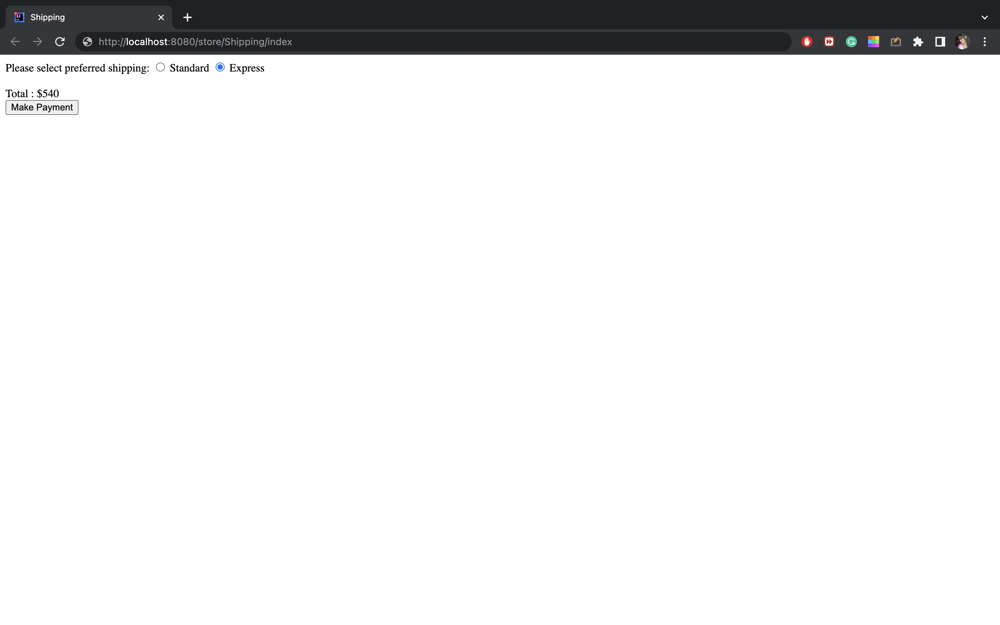
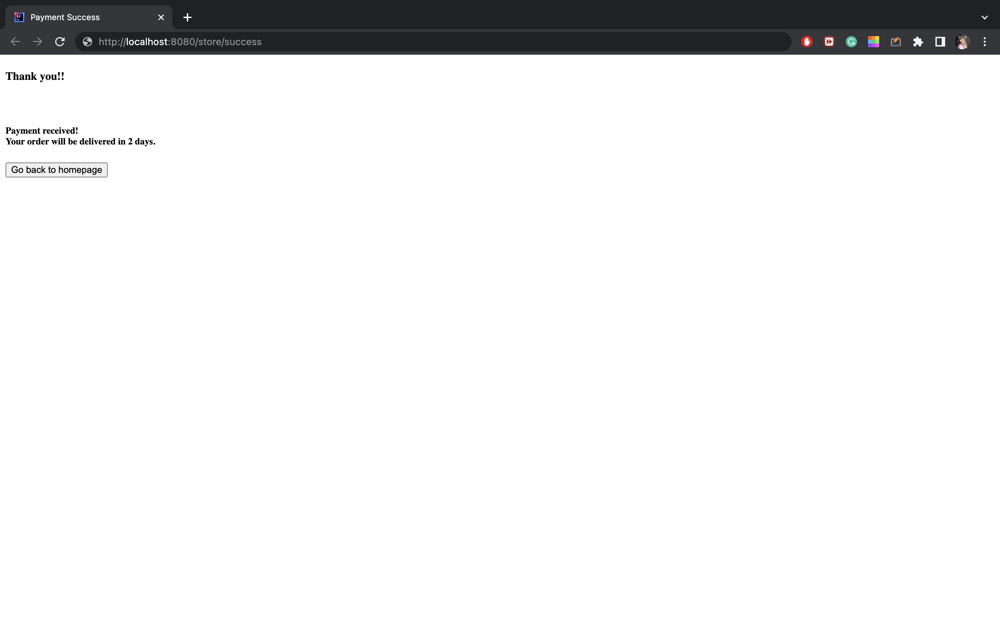

# SE452-Group01

## Objective
This repository serves as the group project for Spring 2023 SE453 Group 01
To build an e-commerce application

**Project Scope Area**
---
E-commerce
We are developing a basic shopping application.
The user can create an account and browse various categories and products.
The user can place an order and make a payment through the application.

 
* Milestone 1: Discussed and determined the project and created the skeleton base structure and divided the functional areas for each member to work. 
* Milestone 2: Created the project data persistence and few basic services for each functional module.
* MileStone 3: Updated few tables based on requirement and added mappings as needed, Created few customized services, Updated the package-info.java
* Final Submission: Added the ui layer and implemented Spring Security for 2 type of users for authorization operations
**Project Members**
---
| Name          | Functional Area                |
|---------------|--------------------------------|
| Karthik       | Account Management             |
| CHandrashekar | Category and Products Module   |
| Josh          | Orders & Cart Module           |
| Bramhashree   | Payment Transaction & Shipping |

**Conflict Resolution**
---
Decide as a group after team discussion

**Communication Mechanism**
---
MS Teams and Whatsapp 
Will meet twice a week or more if needed.

**Decision Made**
---
1. IDE - IntelliJ (everyone were comfortable)
2. Dependency Management - Gradle (familiarity)
3. Code - Lombok (Learning new library)
4. Configuration Management - Yaml (found this more easier to implement)
5. Database - MariaDB (running on ec2, made our work more easier)

**Meeting Journal**
---
We all met in MS Teams and disucssed about the various scope areas. 
We then finalised on developing an E-commerce application (basic shopping application).
We then created a git repository for our project.
After assigning the functional areas for each team member, each of us tried to make changes in the README file and push it to the repository.
We finally created the Spring Skeleton with the above mentioned configurations and pushed it to the Git repository.
As of now everyone is working on their functional tables.
---
We created entities corresponding to each functional area and mapped them with the database tables.
Using CrudRepository we we were able to use the build-in functions such as save, delete, findById, finaAll, update, etc.
We created Controllers and Service classes accordingly and also successfully test it both through Postman and Junit testcases.
---
As per the feedback, we added the package-info files for each package
We implemented the Logging using Log4j2
We also included additional services that would support the Application flow.
Concepts such as relation mapping and inheritance were considered while designing the application.
We discussed about the UI layer in the meeting and finalised on implementing Angular JS.
Currently working on including NoSql to support certain features of the app.

| #   | Date      | Note                                                                                                                                     |
|-----|-----------|------------------------------------------------------------------------------------------------------------------------------------------|
| 1   | 4.3.2023  | We discussed and decided our project scope and made decisions on IDE,Database, Code, Dependency Management,etc                           |
| 2   | 4.6.2023  | We created the Springboot skeleton for the project based on the decisions made, and divided the functionalities for members of the team. |
| 3   | 4.8.2023  | Tried to merge our code in README file and learnt basics of git repository                                                               |
| 4   | 4.22.2023 | Discussed primary keys, foreign keys for all the tables and implemented them                                                             |
| 5   | 5.08.2023 | We discussed on few database relations and how to create controllers and services and test cases for them                                |
| 6   | 5.10.2023 | We discussed about individual codes and validated the approaches for the project. We decided to implement swagger                        |
| 7   | 5.16.2023 | We discussed about the front end preferences and decided to add thymeleaf dependency                                                     |
| 8   | 5.27.2023 | Went over authentication and authorization implementation ans also completed ui and its integration                                      |
| 9   | 6.3.2023  | Went over the rubrics and made sure nothing was pending for the finals                                                                   |

---
**Appendix**
**Working Screenshots of group member 1: Bramhashree Manoharan**

**Working Screenshots of group member 2:**

**Working Screenshots of group member 3:**

**Working Screenshots of group member 4:**

